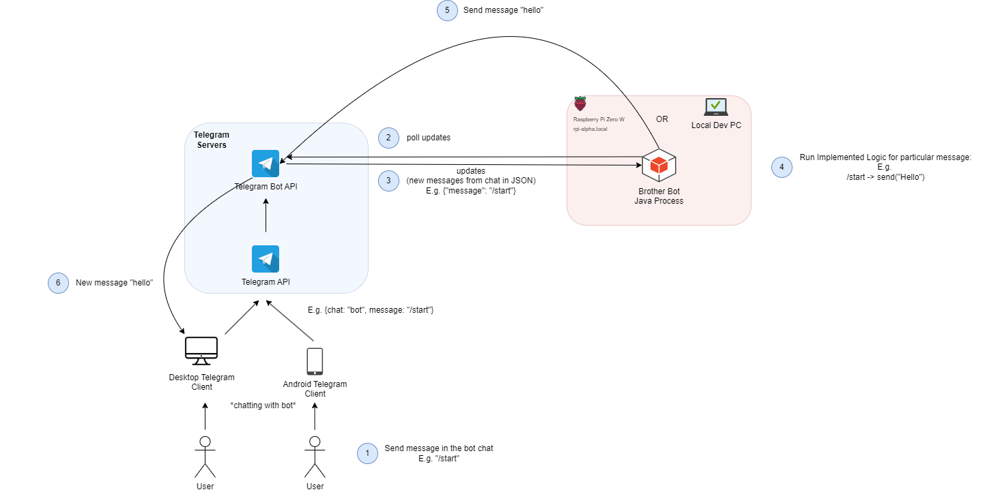
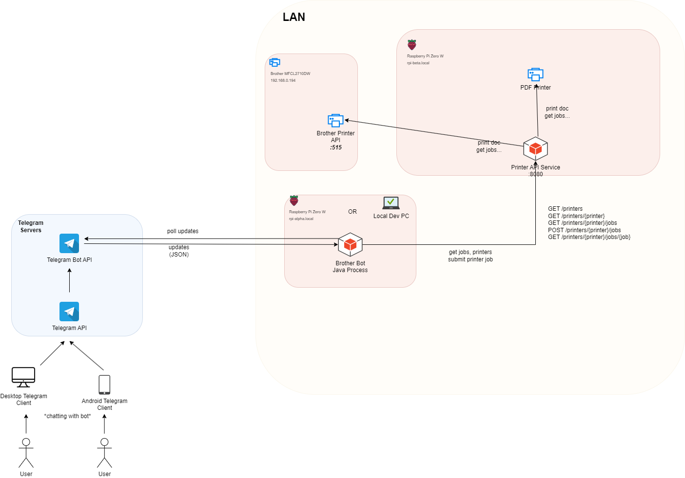
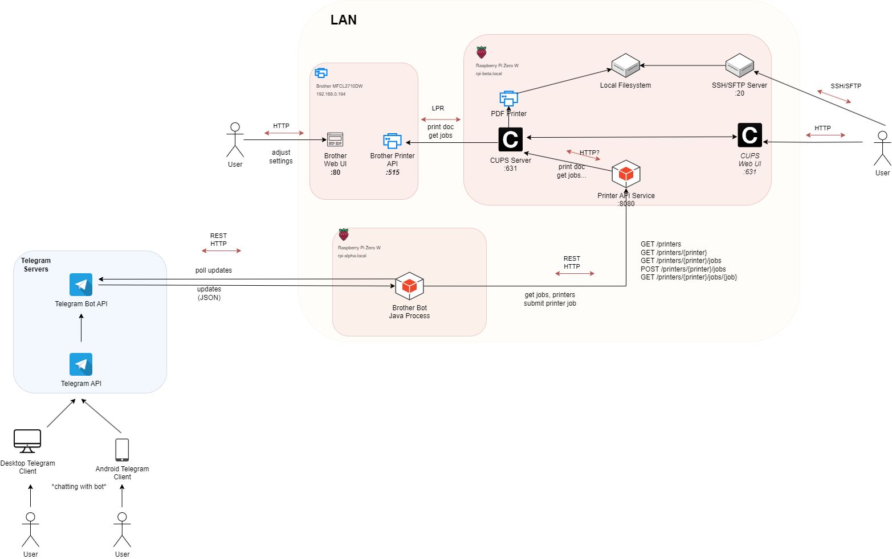
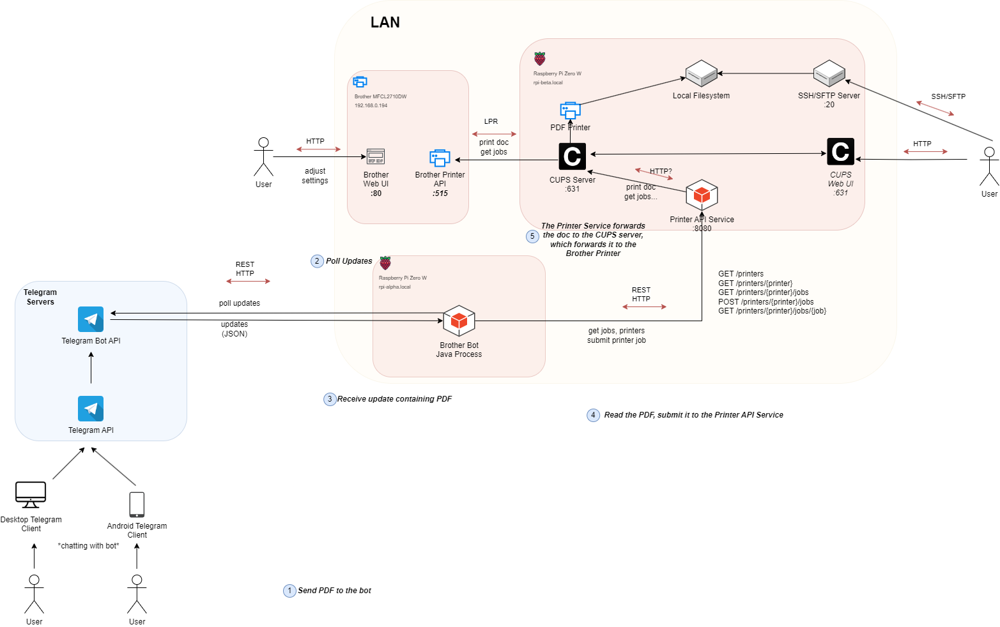

# Part I - Telegram Bot API + IO
Simplified architecture of some components:

1. Brother Bot Process
   - defines logic, how the telegram bot would react to the given messages/commands
   - is responsible for sending PDF files for printing
   - polls periodically the Telegram Bot API for the updates/new messages and process them according to the defined logic
2. Telegram Bot API
   - returns the updates/received messages by the bot on request from the Brother Bot Process
3. LAN Machines/Servers:
   - rpi-beta: raspberry pi, hosting the brother telegram bot (rpi-alpha.local)
   - local dev PC, hosting the telegram bot during development

## Tasks
### Task 1
Clone repo (always add commits for each task and each small fart)

### Task 2
1. Run the bot locally, edit the app.config. Ask me for the actual token value.
2. Open bot chat @brobrobotbotbot
3. send /start message in the chat
4. send a sticker
5. Observe the responses

### Task 3
Change /start message response to anything else -> run again -> verify

### Task 4
1. Add "/help" command to the bot, that sends a list with all commands (/start /help etc.)
2. Verify the command in the bot chat

### Task 5
1. Change the response message, when handling a sticker message to "Based".
2. Send response as two separate messages ("Based", "Good shit") or whatever you want as a reponse to a sticker message

### Task 6
1. Implement a handler to react on an image message. 
2. Send some funny response when user sends a picture 

### Task 7
1. Save locally each image that was sent
2. Check that it's working, by verifying the image 

### Task 8
Implement /image command that sends a message "THIS WILL BE AN IMAGE" (siehe task 2)

### Task 9
Change behavior /image command:
Load any local image and send as a response (e.g. load a previously saved image)

# Part II - Sending HTTP requests

Extended architecture of the main components:

1. Printers
   - Brother MFCL2710DW (the actual printer)
   - PDF Printer (the virtual printer, that prints to the PDF file stored on the filesystem of rpi-beta.local)
2. Printer API Service
   - acts as a facade, simplified API for printing, without accessing printers directly
   - processes simplified incoming HTTP/REST requests and forwards them to the desired printers
3. Brother Bot Process
   - defines logic, how the telegram bot would react to the given messages/commands
   - primarily forwards the received PDF docs to the Printer API Service
   - polls periodically the Telegram Bot API for the updates/new messages and process them according to the defined logic
4. Telegram Bot API
   - returns the updates/received messages by the bot on request from the Brother Bot Process
5. LAN Machines/Servers:
   - Brother Printer: the actual printer (192.168.0.194)
   - rpi-alpha: raspberry pi, hosting printer api service + PDF Printer (rpi-beta.local)
   - rpi-beta: raspberry pi, hosting the brother telegram bot (rpi-alpha.local)
   - local dev PC, hosting the telegram bot during development

## Tasks
### Task 1
1. Run in Postman: GET https://postman-echo.com/get and inspect the response
2. Google how to add a **_query parameter_** to the URL. Change the request to include a query parameter "a=1".
3. Inspect the response from the 2. step. What has changed? What does the request do in general? What is the "url" field of the response?
3. Get JSON list of printers using Printer API Service via Postman (GET /printers) (siehe below Printer API Service)

### Task 2
Create a junit test PrinterServiceTest.mathWorks(), that checks whether the 2+2 is 4 and fails if its not,
using `assertEquals`

### Task 3
1. Run PrinterServiceTest.httpClient() test and observe, if it's the same as the Postman request+response from task 1
2. Verify that the URL from the "url" field of the response has been parsed correctly on the last output line of the test
3. Change the behavior of the test to run request with a query parameter "c=5". Inspect the "args" field of the response in the output
4. Change the behavior of the test to parse the "args" field instead of the "url" field. Print the args field.

### Task 4
1. Remove the parsing part of the previous responses.
2. Let the new http client execute the GET /printers endpoint of the Printer API Service instead. Run the test. It should print the response obtained after executing GET /printers request
3. Inspect the response, that was obtained from the executing /printers endpoint. Is it the same as in the one from postman in task 1?
4. Parse the response into JSON Array Object. Print the first object of the JSON Array
5. Parse the "name" field of the first object of the JSON Array into String. Print it.

### Task 5
1. Create an instance of class aljolen.api.model.Printer in the same test. What parameters does it require to be passed?
2. Parse the "name", "url", "description", "location" fields  of the **FIRST!** printer of the JSON Array response, when executing GET /printers endpoint.
3. Create a new Printer() instance, passing the parsed fields from the JSON object in the fields with the same name.
4. Print out the printer instance
5. Iterate over the JSON Array, that represents the response obtained from  GET /printers. 
6. Parse an ArrayList<Printer>() of printers. Each element of the ArrayList corresponds to one JSON Object of the JSON Array of the response.

### Task 6
1. Create a class that implements aljolen.api.PrinterService
2. Add an implementation of printer service api that does nothing, when executing service.getPrinters(). Just returns empty Array
3. Create a new test, instantiate the new class. Run .getPrinters() check that the list is empty via assertTrue(list.isEmpty()), where the list has the result of .getPrinters()

### Task 7
1. Extend the implementation of PrinterService that 
- uses internally http client from before
- runs the request to `GET /printers`, when `.getPrinters()` is executed
- parses the response into JSON ARRAY
- parses the JSON ARRRAY into the List of printers
- returns the List of printers in `.getPrinters()`
2. Create a test, run the service.getPrinters(), verify the length is two. (i.e., two printers)

### Task 7
1. Get particular printer via postman (`GET /printers/{printer}`)
2. Get particular printer via http client in test
3. Create a method in PrinterService, that could be used to retrieve info on a particular printer. With following signature: Printer getPrinter(String name)
4. Implement the method as in Task 7. Send request, parse in JSON, create a Printer instance, return it. Create a test

### Task 8
1. Add a new "/printers" command to the telegram bot 
   - sends a message listing the names of all printers as a reply via GET /printers
   - in any beliebigem Format
   - for executing GET /printers use implemented method from PrinterService
   - Pass an instance of a class implementing PrinterService interface to the BrotherBot constructor in main method
   - use it inside the "/printers" defining command

# Part III - Printing

The full version of the architecture

New components:

1. CUPS
    - used for managing printers, locations, groups, discovering, settings, adding and removing printers
    - Two services
        - The backend - the one, that is used by Printer API Service
        - The frontend - the web UI, can be accessed directly via port :631
2. SSH/SFTP Server
    - the SSH/SFTP server running on rpi-beta.local, allowing uploading files and running processes

## Tasks
### Task 1
Create a SSH key-pair using `ssh-keygen -t rsa`. Any password, any name, any email. Verify `~/.ssh/id_rsa` and `id_rsa.pub`. What is private and what is public key? Gib mir Bescheid, sobald du damit fertig bist.

### Task 2
SSH to rpi-beta.local

### Task 3
Upload arbitrary file to rpi-beta

### Task 4
Download arbitrary file from rpi-beta

### Task 5
Send a PDF (test.pdf) doc to print via Postman, using the PDF Printer, the virtual one. Use `POST /printers/{printer}/jobs` with a body containing a file. (Select body -> binary -> upload pdf). Memorize the job number

### Task 6
Verify the success of printing the document by sshing to rpi-beta and checking `~/PDF folder`. Check the number of the job it returned with the filename

### Task 7
Everything must be done in a test case.
Send a PDF Doc for printing via http client using the virtual PDF printer:
- Read the PDF doc data via InputStream, the same as image.
- Send it as POST in the body via Body. 
- Use `.POST(HttpRequest.BodyPublishers.ofByteArray(inputStream.readAllBytes()))` on http client 
- Print the response
- Explain whatehell has happened

### Task 8
1. Add a new method `void sendJob(String printerName, InputStream data)` to PrinterService
2. Instead of `void`, which should hold the response. You can also use JSONArray, String or create a separate Object and parse the JSON. You can just leave it void for now.
3. Add an implementation of the method, using above technique of sending POST request to the server. Ignore the response if you chose `void`, otherwise parse the response accordingly

# Part IV - Printing via Bot
### Task 1
Add a new handler in the BrotherBot for reacting to any document. Send message or something

### Task 2
Additionally, to the message save locally the doc provided by the user. Read it locally and verify its saved correctly.

### Task 3
Send the doc manually via Postman or test http client for printing in the PDF printer!!. Verify via ssh that it works

### Task 4
Instead of sending it manually. Pass the InputStream directly to service.sendJob("PDF", data), where "PDF" is the name of the target printer.

### Task 5
Run the chat, send a doc, verify by sshing to rpi-beta, it has created a PDF file

### Task 6
Change the target printer finally to the actual "MFCL2710DW" printer. Run again, Should work. If not verify by uploading manually, or via http client.
You are awesome!

# Part V - Deployment
### Task 1
Create a new bot via BotFather, update new token, creator in the app.config

### Task 2
Run in the root dir `mvn clean package`. Check `target` folder for the .jar file. This is your compiled program. That can be run by any machine that has Java Virtual Machine installed.

### Task 3
Upload the jar file on the rpi-alpha.local in the home directory `~/`

### Task 4
Run `java -jar *.jar` with the name of your jar

### Task 5
Open the bot chat, verify its working. You are the best!

# Part VI — Advanced
1. Make inline buttons (Retry Job, Cancel Job, Pause Job, Update Status) 
2. Endpoints for checking job status, retry, cancel, pause, update
2. Printing with a copy parameter

# Printer API Service
REST API (host: http://rpi-beta.local:8080) 
List of all available printers

    GET /printers

Get printer info by name

    GET /printers/{printer}

Get jobs of the printer

    GET /printers/{printer}/jobs

Post a job with document in the body

    POST /printers/{printer}/jobs?copies=1

Get the job info by name

    GET /printers/{printer}/jobs/{job}

# Telegram Bot library
https://github.com/rubenlagus/TelegramBots/wiki/Getting-Started

# Telegram Bot
@brobrobotbotbot

# Brother BOT Capabilities

1. **/start** - Sends start message
2. **/help**  - Sends a help message with all commands
3. **Any Image** - Sends some funny response
4. **/printers** - Sends the list of available printers
5. **Any DOCUMENT** - Sends the document for printing and replies with a message
6. **/printers {printer}** - Sends info about specific printer
7. **Any Document + {number}** - Prints n copies of the

# The Big Picture
Whole architecture of all the main components:
